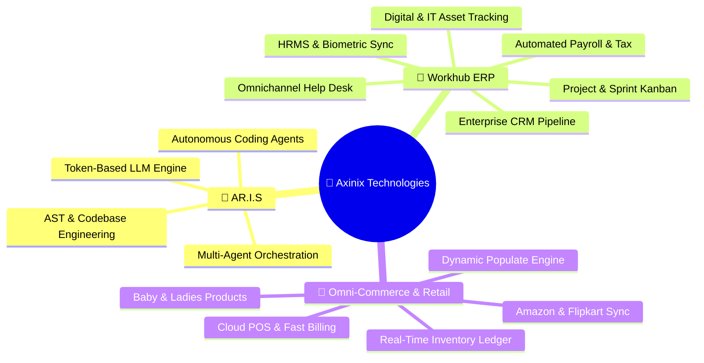

<div align="center">

```
   █████╗ ██╗   ██╗██╗███╗   ██╗██╗██╗  ██╗
  ██╔══██╗╚██╗ ██╔╝██║████╗  ██║██║╚██╗██╔╝
  ███████║ ╚████╔╝ ██║██╔██╗ ██║██║ ╚███╔╝ 
  ██╔══██║ ██╔═██╗ ██║██║╚██╗██║██║ ██╔██╗ 
  ██║  ██║██╔╝ ██╗ ██║██║ ╚████║██║██╔╝ ██╗
  ╚═╝  ╚═╝╚═╝  ╚═╝╚═╝╚═╝  ╚═══╝╚═╝╚═╝  ╚═╝
   T   E   C   H   N   O   L   O   G   I   E   S
```

# 🚀 Axinix Technologies
### *"Build Next Gen Today"*

---

[](#)
[](#)
[](#-founding-leadership)
[](#-strategic-product-ecosystem)

<br />

**Axinix Technologies** is a modern technology innovation lab and software product studio. We engineer next-generation artificial intelligence agents, enterprise SaaS ERP platforms, and high-performance multi-channel commerce engines designed to scale businesses seamlessly from local operations to global markets.

---

</div>

<br />

## 🌐 Strategic Product Ecosystem



---

### 1. 🤖 AR.I.S — Artificial Intelligent System
> **Core Focus**: Autonomous LLM & Agentic Token Architecture

* **Autonomous Code Generation**: An internal intelligent agent framework engineered to assist and automate codebase creation, refactoring, and AST inspections (comparable to Claude / Codex agentic pipelines).
* **Token-Optimized Micro-Agents**: Domain-specific autonomous agents operating on structured token-efficient context pipelines for real-time task orchestration.
* **Embedded Intelligence**: Deeply woven into all Axinix platforms to power intelligent auto-completion, contextual summaries, and business intelligence.

---

### 2. 🏢 Axninx Workhub — Enterprise Multi-Tenant SaaS Platform
> **Core Focus**: Unified All-In-One Enterprise Operations Suite

A multi-tenant cloud operations system engineered for enterprise efficiency:
* **HRMS & People Operations**: Complete employee lifecycle, attendance, performance reviews, and document automation.
* **Automated Payroll**: Accurate salary computation, deduction rules, tax sheets, and automated payslip delivery.
* **Help Desk & Service Management**: SLA-driven internal and customer ticketing with multi-channel routing.
* **Project & Task Management**: Interactive sprint boards, backlog planning, and Gantt timeline tracking.
* **Enterprise CRM**: Lead acquisition funnels, client communications, and pipeline conversion metrics.
* **Asset Tracking & Ledger**: Real-time management of hardware, devices, software licenses, and asset assignment.

---

### 3. 🛍️ Axinix E-Commerce - An Omnichannel Marketplace Engine for Sales
> **Core Focus**: High-Throughput Retail, Inventory Ledgering & Live Marketplace Connectivity

A specialized, high-performance retail and inventory management platform currently serving the **Retail** industry:
* **Live Marketplace Integration**: Bidirectional real-time sync with **Amazon** and **Flipkart** for automated inventory counts, price updates, and order ingestion.
* **Unified Inventory Ledger**: Centralized multi-warehouse stock reservation preventing overselling across online and retail channels.
* **Point of Sale & Billing**: Ultra-fast POS billing engine with instant invoice generation and tax compliance.
* **Dynamic Architecture**: Powered by the architecture with zero redundant controllers/routers, streaming Gzip backups, and single-source semver automation.

---

## 👥 Founding Leadership

<div align="center">

| Name | Role | Strategic Focus |
| :--- | :--- | :--- |
| **Arunbharathi** | **Founder** | Product Vision & Architecture Governance |
| **Ajay** | **Co-Founder** | Technology & UI/UX Development |
| **Boopalan** | **Co-Founder** | Operations & Product Development |
| **Siva** | **Co-Founder** | Business Growth & Marketing |
| **Guru** | **Co-Founder** | Product Designing  |
| **Karuppasamy** | **Co-Founder** | Testing & Quality Assurance |

</div>

---

## 🛠️ Technology Radar & Engineering Stack

<div align="center">

| Domain | Core Technologies & Frameworks |
| :--- | :--- |
| **AI Services** | Python, AR.I.S, LangChain, Vector Embeddings, Token Pipeline |
| **Backend & APIs** | Node.js, Express.js, Dynamic Populate Pipeline, Mongoose, Streaming Gzip |
| **Frontend & Web** | React 19, Next.js, Vite 6, Tailwind CSS v4, Lucide React, Glassmorphism |
| **Databases & Cache** | MongoDB Atlas, In-Memory Caching, Redis, Transactional Session Engines |
| **Integrations** | Amazon SP-API, Flipkart Marketplace API, Webhook Handlers, Cloud POS |
| **DevOps & Gates** | SemVer Automation (`version.json`), Pre-Deploy Gates, node-cron Schedulers |

</div>

---

## 📐 Core Engineering Principles

1. **"Build Next Gen Today"** — We don't construct legacy systems. Every product is architected with modern asynchronous patterns, responsive reactive interfaces, and automated CI/CD deployment gates.
2. **Single Source of Truth** — No fragmented configurations. All schema definitions, versions, and role policies are governed from centralized authoritative registries.
3. **Populate-Helper First** — Business logic belongs in decoupled domain service hooks, maximizing code reuse, automated data sanitization, and security validations.
4. **Resilient Data Governance** — Automated database lifecycle tracking with streaming compressed backups and self-pruning retention engines.

---

<div align="center">

### 🤝 Let's Connect

**Axinix Technologies** is continuously pioneering next-generation software products.  
Interested in collaborating, investing, or joining our mission? Reach out directly to our leadership team:

📧 **Founder & Executive Contact**: [`arunbharathi.parkkavamani@gmail.com`](mailto:arunbharathi.parkkavamani@gmail.com) *(Arunbharathi)*

<br />

**Motto**: *"Tomorrow Starts Today"*  
<sub>© 2026 Axinix Technologies. All rights reserved. Confidential & Proprietary.</sub>

</div>
